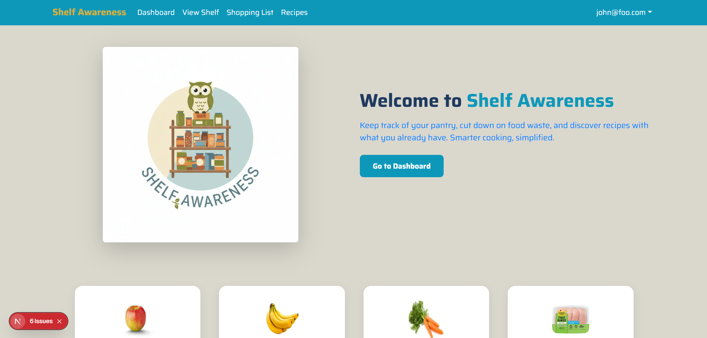
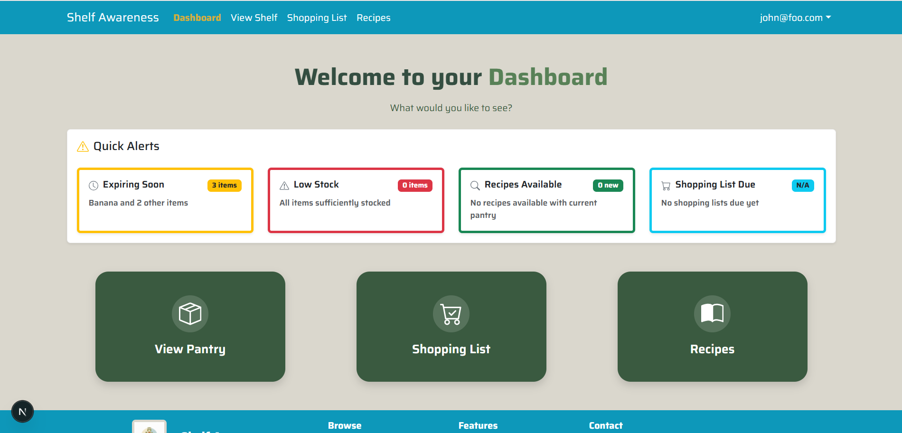
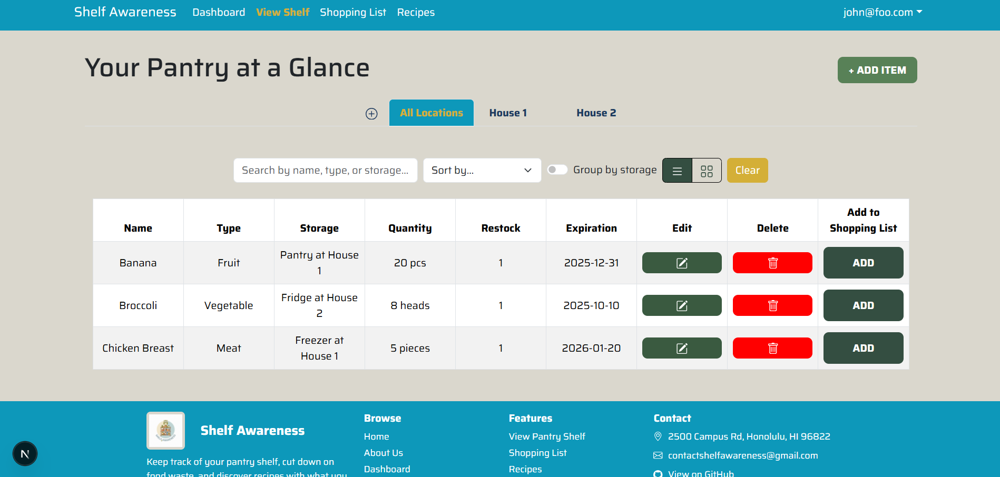
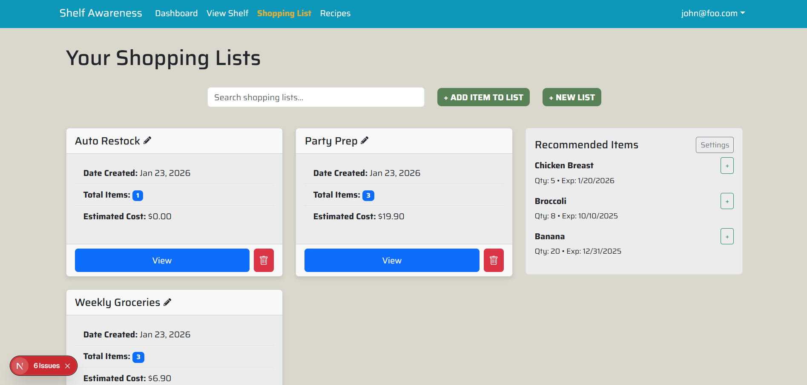
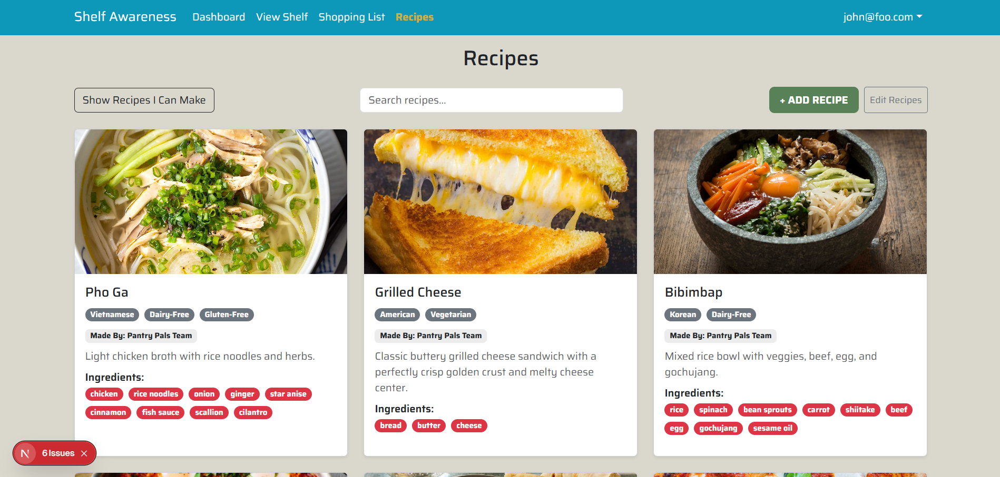
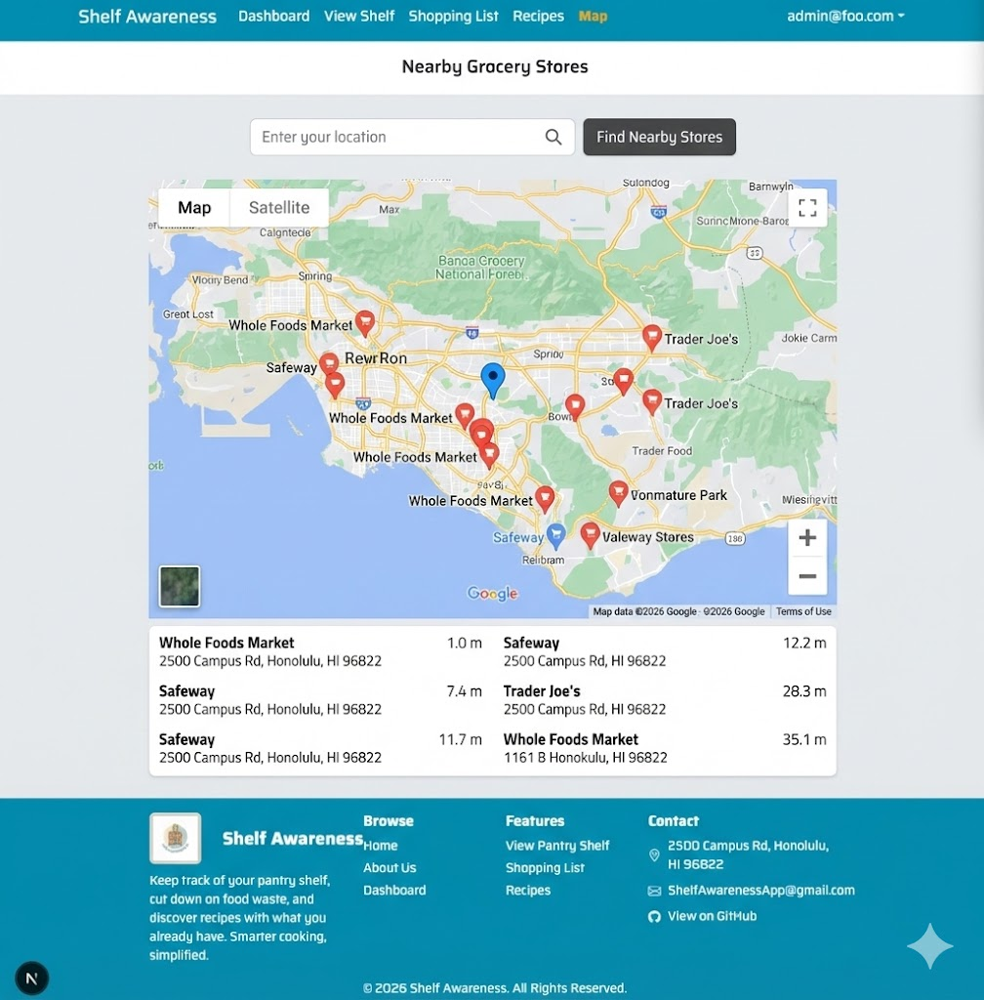

# Shelf Awareness: Learning to be Shelf Aware. 

## Table of Contents

* [Overview](#overview)
* [Team](#team)
* [Our GitHub](#our-github)
* [M1](#milestone-1)

---

## Overview

Shelf Awareness is a centralized mobile and web application designed to provide a digital inventory system for managing household food storage, including pantries, refrigerators, freezers, and spice racks. The application allows users to add, remove, and edit items, while tracking item quantities and expiration dates.

Using this information, Shelf Awareness can automatically generate shopping lists for items that are running low, required for selected recipes, or nearing (or past) their expiration dates—helping users stay organized and reduce food waste.

The application will allow for two types of users.

* Admins can add, delete, and review recipes.
* Users can create and manage multiple pantries, add, update, and delete pantry items, add and view recipes, generate shopping lists, and view a map of nearby grocery stores. 

## Use Cases 

* Users can create a shopping list based on needed ingredients for a receipe.
* Users can generate shopping lists based on items that are expired or low in stock.
* Application will track item quanties across all storage locations.
* Use expiration reminders to suggest recipes to help reduce food waste.

## Beyond The Basics

* Users can leave a review on recipes that they liked or disliked.
* Macro and Protein tracker for meals or in the current grocery list
* Fully Mobile Friendly interface
* Barcode scanner to automatically add an item to be reivewed before adding it to the pantry

## User Guide / Page Mockups
Below provides a walkthrough of the Shelf Awareness applications that includes its user interface.

*Use of generative AI disclaimer: Page mockups were generated using AI*
### Landing Page

  

### Sign In Page

  

### Shopping List Page

  

### Recipe Page

  

### Mobile View

  

---

## Team

Shelf Awareness is designed, implemented, and maintained by:

* Kent Burgess (<kentb@hawaii.edu>)
* Rolando Cadiz (<cadiz808@hawaii.edu>)
* Darilyn Evangelista (<darilyne@hawaii.edu>)
* Cade Kane (<cadekane@hawaii.edu>)
* Kacy Kuniyoshi (<kacykuni@hawaii.edu>)
* Royce Jarvy Uy (<rjuy@hawaii.edu>)

### Team Contract 
Our team's Code of Conduct can be found in the [Team Contract](https://docs.google.com/document/d/1mhxnlLzFu0t8Fo2HIK4T-8mxscm9ioEZLiUzoZB6VKI/edit?usp=sharing)

---

## Our GitHub
* View the Shelf Awareness organization [here](https://github.com/shelf-awareness)
* View the Shelf Awareness project repository [here](https://github.com/shelf-awareness/shelf-awareness)
* View the Shelf Awareness github.io page repository [here](https://github.com/shelf-awareness/shelf-awareness.github.io)

---

## Milestone 1

### Overview
Milestone 1 focused on establishing a stable, well-documented foundation for the Shelf Awareness application. Since this project is based on a forked repository, much of the core functionality (pantry management, shopping lists, recipes, and UI components) was already implemented. The primary goal of this milestone was to align the existing codebase with our project goals (primarily through making mockup pages) and modernize the development environment by updating packages to prepare the application for future feature development. 

During Milestone 1, we focused on the following tasks: 
#### Project Planning and documentation
- Created and documented user stories in the GitHub Discussions tab to define project scope and user goals.
- Updated the project GitHub Pages site to reflect current project status and milestones.
- Created the Milestone 2 project board to plan upcoming development.

#### Development Environment & Tooling
- Updated npm dependencies and resolved compatibility issues.
- Upgraded the project to support Next.js 15.5.7 and React 19.
- Set up and verified the database using Prisma.
- Improved account creation by updating the email verification workflow.

#### UI/UX & Branding
- Rebranded the website, including updated color scheme, theme, logo, navbar, and footer.
- Designed mobile friendly implementation for key components and pages (ex. View Pantry, Recipes, Shopping List)

#### Quality Assurance
- Performed acceptance testing to ensure existing features function correctly after dependency and configuration updates.

### Milestone 1 Progress and Mockups
Landing Page

  

Dashboard Page

  

View Shelf Page

  

Shopping List Page

  

Recipe Page

  

Map Mockup
*Use of generative AI disclaimer: Mockup was generated using AI*

  

"Recipes Within Budget" Filter Mockup

  

