# Shelf Awareness: Learning to be Shelf Aware. 

## Table of Contents

* [Overview](#overview)
* [Team](#team)
* [Our GitHub](#our-github)
* [M1](#milestone-1)
* [M2](#milestone-2)
* [M3](#milestone-3)

---

## Overview

Shelf Awareness is a centralized mobile and web application designed to provide a digital inventory system for managing household food storage, including pantries, refrigerators, freezers, and spice racks. The application allows users to add, remove, and edit items, while tracking item quantities and expiration dates.

Using this information, Shelf Awareness can automatically generate shopping lists for items that are running low, required for selected recipes, or nearing (or past) their expiration dates—helping users stay organized and reduce food waste.

The application will allow for two types of users.

* Admins can add, delete, and review recipes.
* Users can create and manage multiple pantries, add, update, and delete pantry items, add and view recipes, generate shopping lists, and view a map of nearby grocery stores. 

## Use Cases 

* Users can create a shopping list based on needed ingredients for a receipe.
* Users can generate shopping lists based on items that are expired or low in stock.
* Application will track item quanties across all storage locations.
* Use expiration reminders to suggest recipes to help reduce food waste.

## Beyond The Basics

* Users can leave a review on recipes that they liked or disliked.
* Macro and Protein tracker for meals or in the current grocery list
* Fully Mobile Friendly interface
* Barcode scanner to automatically add an item to be reivewed before adding it to the pantry

## User Guide / Page Mockups
Below provides a walkthrough of the Shelf Awareness applications that includes its user interface.

*Use of generative AI disclaimer: Page mockups were generated using AI*
### Landing Page

  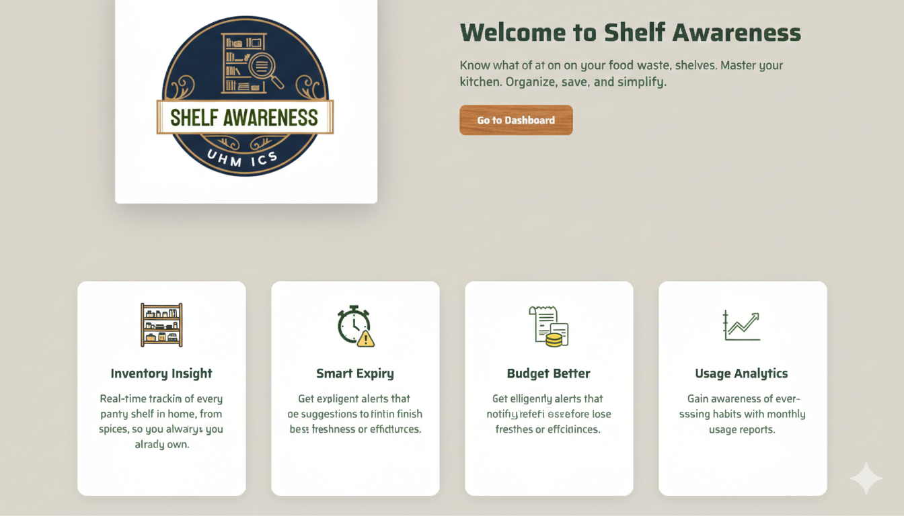

### Sign In Page

  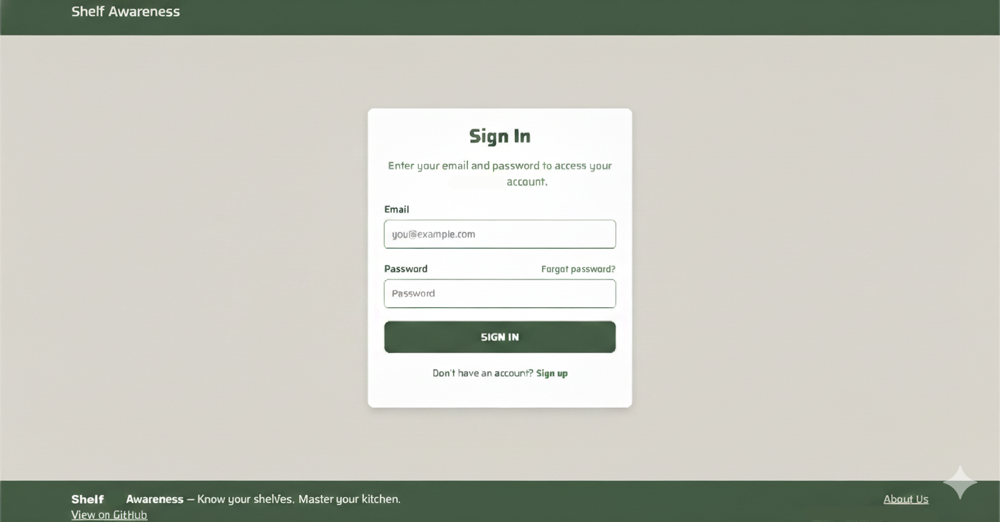

### Shopping List Page

  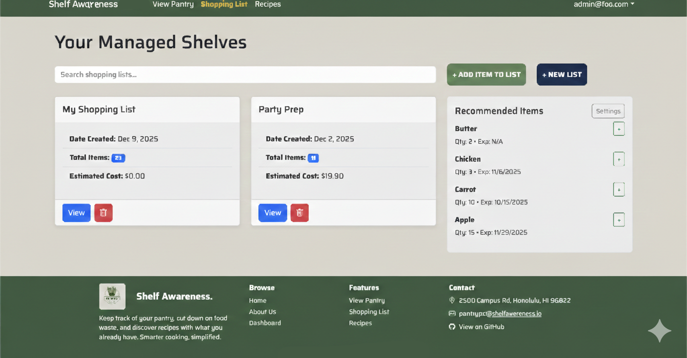

### Recipe Page

  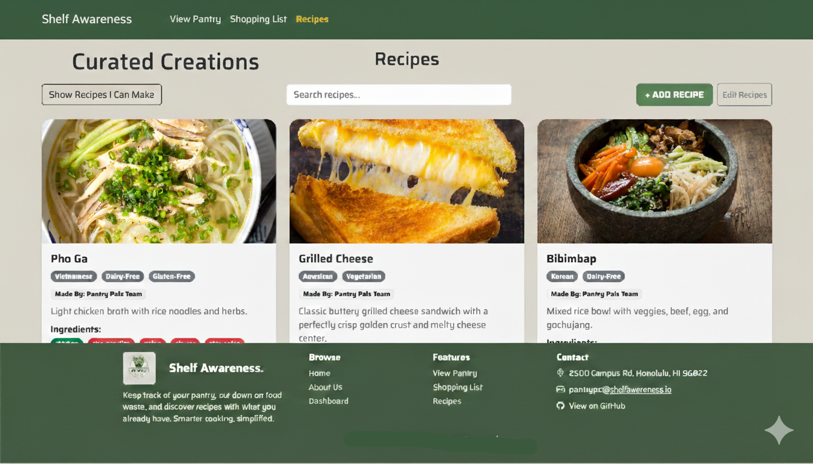

### Mobile View

  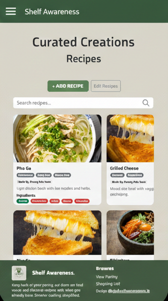

---

## Team

Shelf Awareness is designed, implemented, and maintained by:

* Kent Burgess (<kentb@hawaii.edu>)
* Rolando Cadiz (<cadiz808@hawaii.edu>)
* Darilyn Evangelista (<darilyne@hawaii.edu>)
* Cade Kane (<cadekane@hawaii.edu>)
* Kacy Kuniyoshi (<kacykuni@hawaii.edu>)
* Royce Jarvy Uy (<rjuy@hawaii.edu>)

### Team Contract 
Our team's Code of Conduct can be found in the [Team Contract](https://docs.google.com/document/d/1mhxnlLzFu0t8Fo2HIK4T-8mxscm9ioEZLiUzoZB6VKI/edit?usp=sharing)

---

## Our GitHub
* View the Shelf Awareness organization [here](https://github.com/shelf-awareness)
* View the Shelf Awareness project repository [here](https://github.com/shelf-awareness/shelf-awareness)
* View the Shelf Awareness github.io page repository [here](https://github.com/shelf-awareness/shelf-awareness.github.io)

---

## Milestone 1

### Overview
Milestone 1 focused on establishing a stable, well-documented foundation for the Shelf Awareness application. Since this project is based on a forked repository, much of the core functionality (pantry management, shopping lists, recipes, and UI components) was already implemented. The primary goal of this milestone was to align the existing codebase with our project goals (primarily through making mockup pages) and modernize the development environment by updating packages to prepare the application for future feature development. 

During Milestone 1, we focused on the following tasks: 
#### Project Planning and documentation
- Created and documented user stories in the GitHub Discussions tab to define project scope and user goals.
- Updated the project GitHub Pages site to reflect current project status and milestones.
- Created the Milestone 2 project board to plan upcoming development.

#### Development Environment & Tooling
- Updated npm dependencies and resolved compatibility issues.
- Upgraded the project to support Next.js 15.5.7 and React 19.
- Set up and verified the database using Prisma.
- Improved account creation by updating the email verification workflow.

#### UI/UX & Branding
- Rebranded the website, including updated color scheme, theme, logo, navbar, and footer.
- Designed mobile friendly implementation for key components and pages (ex. View Pantry, Recipes, Shopping List)

#### Quality Assurance
- Performed acceptance testing to ensure existing features function correctly after dependency and configuration updates.

### Milestone 1 Progress and Mockups

#### Landing Page

  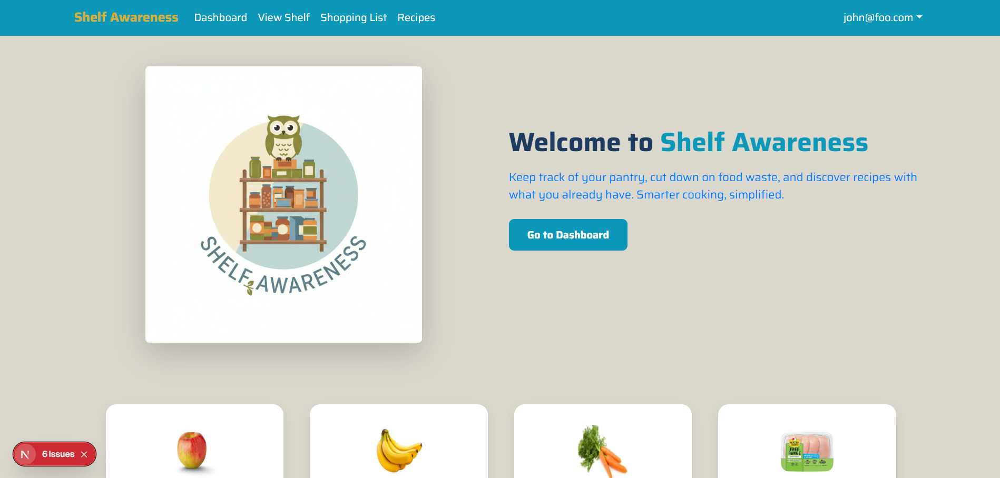

#### Dashboard Page

  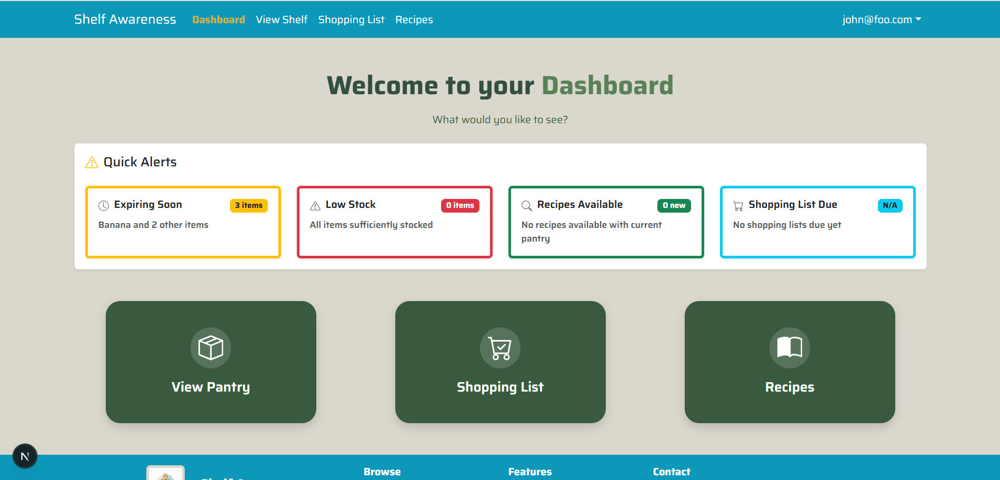

#### View Shelf Page

  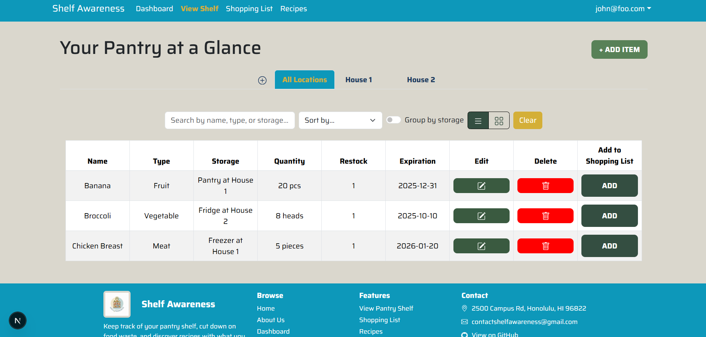

#### Shopping List Page

  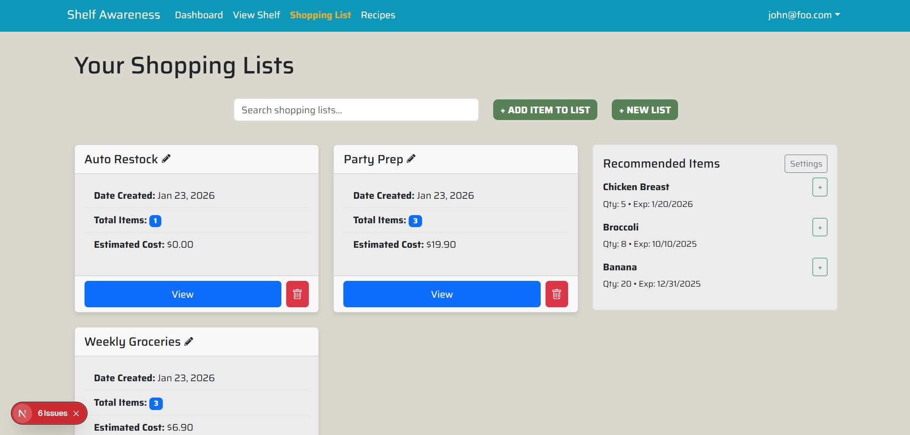

#### Recipe Page

  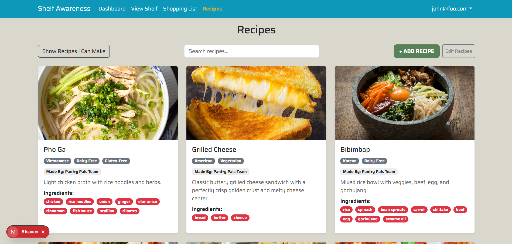

#### Map Mockup
*Use of generative AI disclaimer: Mockup was generated using AI*

  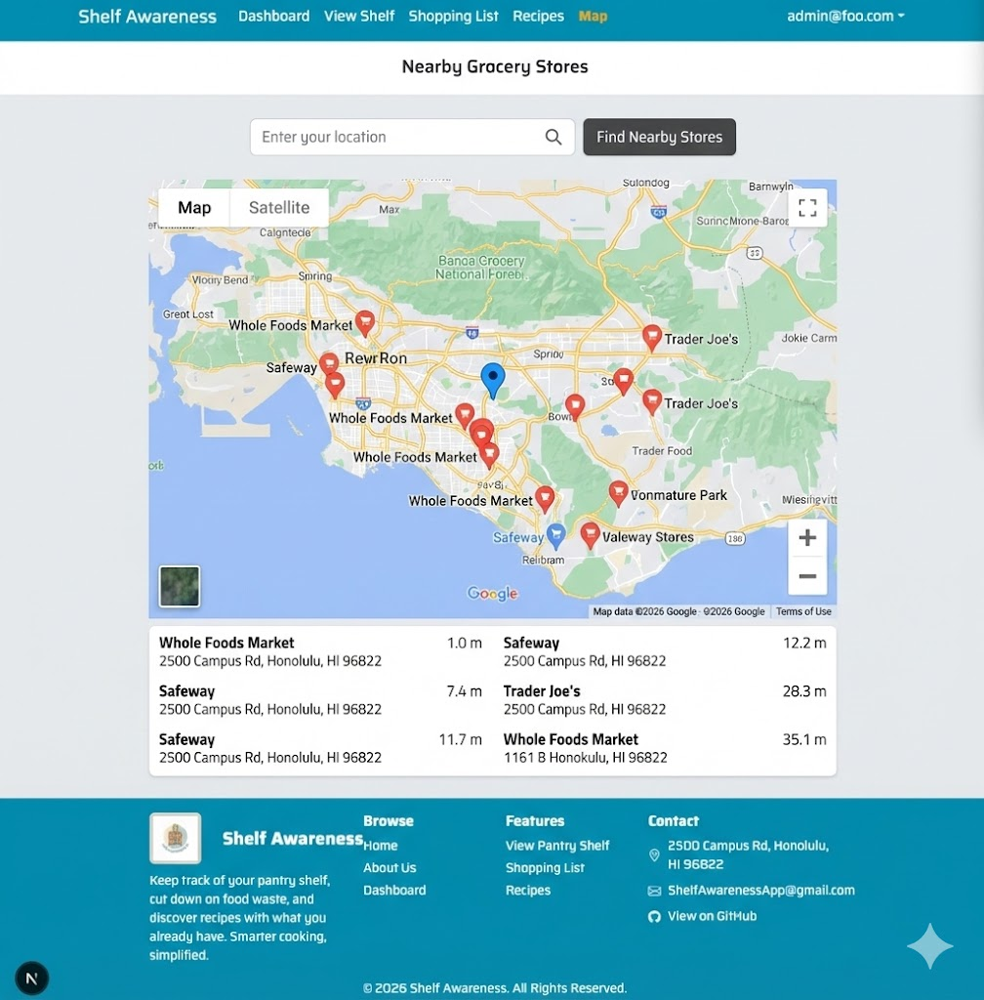

#### "Recipes Within Budget" Filter Mockup

  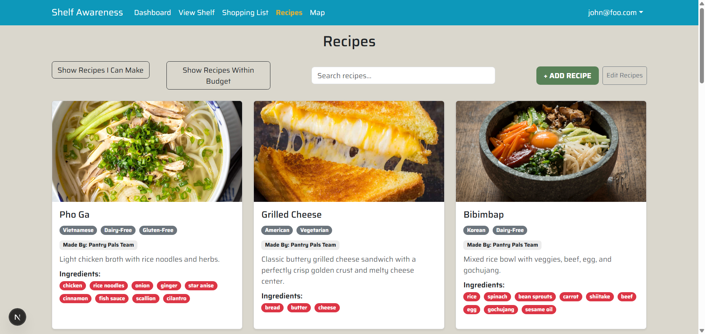

#### Current Mobile Mockups

<table>
  <tr>
    <td align="center">
      <strong>Shelf Mobile Mockup</strong> 
      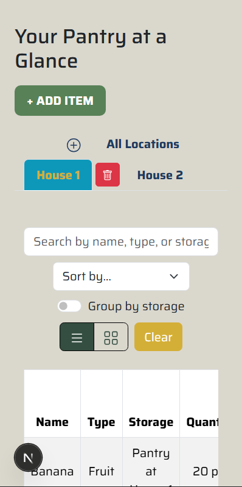
    </td>
    <td align="center">
      <strong>Shopping List Mobile Mockup</strong> 
      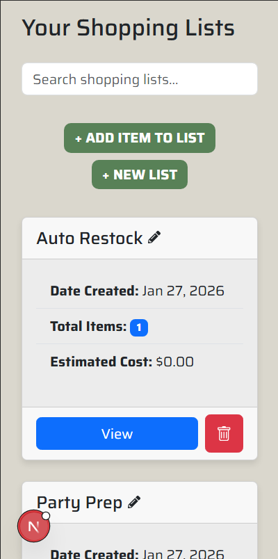
    </td>
    <td align="center">
      <strong>Dashboard Mobile Mockup</strong> 
      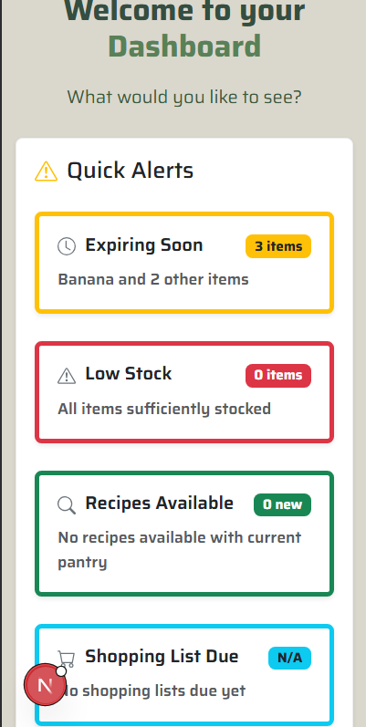
    </td>
  </tr>
</table>

---

## Milestone 2

### Overview
In M2, our focus was on enhancing usability, improving mobile responsiveness, and integrating new features to support different user needs. We completed a thorough mobile-friendly review of all pages, making the app easier to navigate on a variety of devices. Key functionality was added to support three core user stories, improving the experience for both casual users and specialized users like personal chefs and elite bodybuilders.

### Completed User Stories

#### Personal Chef - Ingredient Management
As a personal chef, I want to know what ingredients I have and what I’m missing when making a recipe, and be able to quickly add missing ingredients to my shopping list.
* “Add all missing ingredients” and “Add individual missing ingredients” buttons
* Correctly adds selected items to the shopping list

  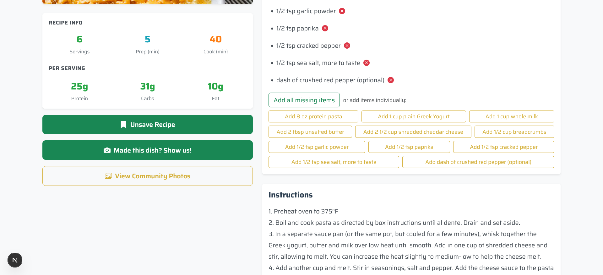

  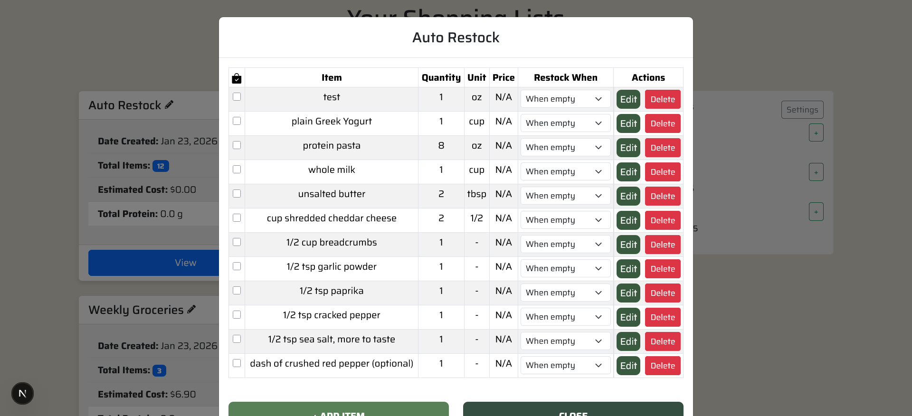

#### BodyBuilder - Macro Tracking
As an elite bodybuilder who needs at least 50g of protein daily, I want macro and protein information on recipes and the ability to import recipes.
* Added macro fields (protein, carbs, fats) to recipe cards
* Displays nutritional information on recipes for easy tracking

  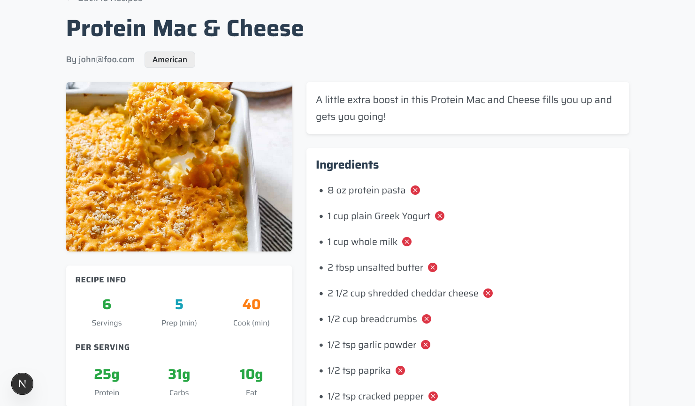

#### Casual User - Save Recipes
As a casual home cook, I want to save recipes I enjoy so that I can quickly find them later.
* New “Saved Recipes” page
* Save/Unsave recipe buttons added to all recipe cards

  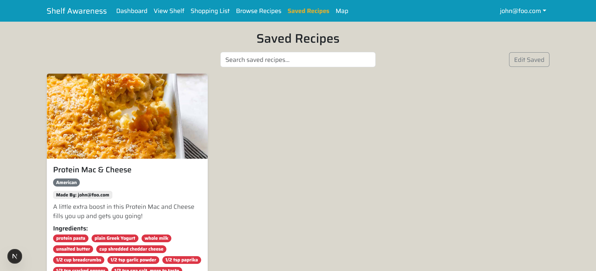

#### Add and Display Protein Information In Shopping List

  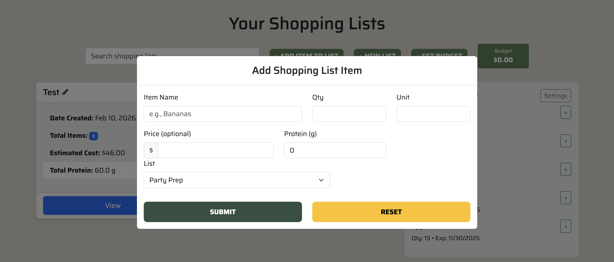

### Additional Implementation and Improvements
* Mobile-friendly review completed for all pages; some minor spacing adjustments may still be needed.
* Functionality has been tested to ensure smooth integration with existing features.
* Replace all instances of firebase with PostgresSQL
* Unit Converter algorithm
* Create a form for setting a budget that will be implemented in M3

<table>
  <tr>
    <td align="center">
      <strong>Recipe Mobile View</strong> 
      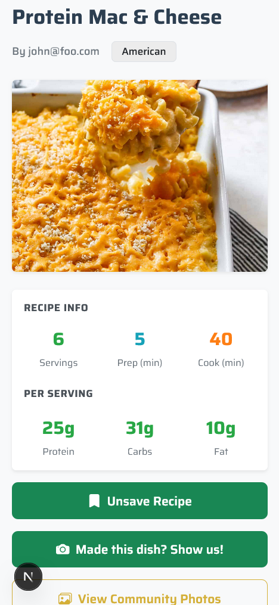
    </td>
    <td align="center">
      <strong>Saved Recipe Page Mobile View</strong> 
      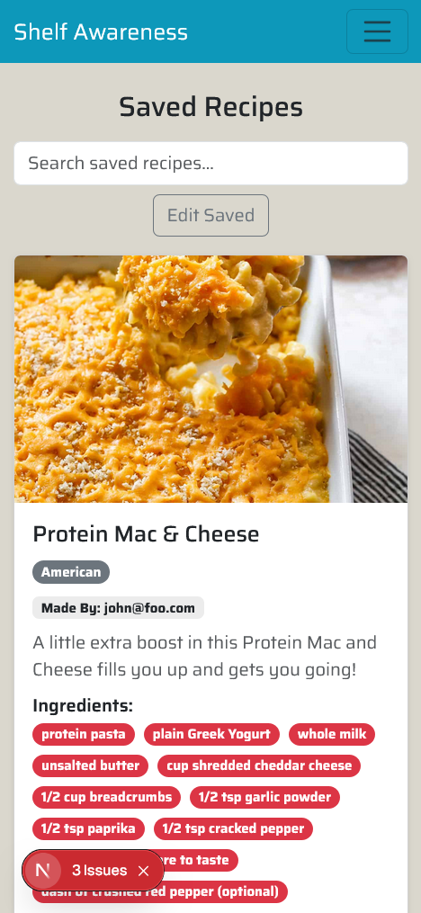
    </td>
    <td align="center">
      <strong>Landing Page Mobile View</strong> 
      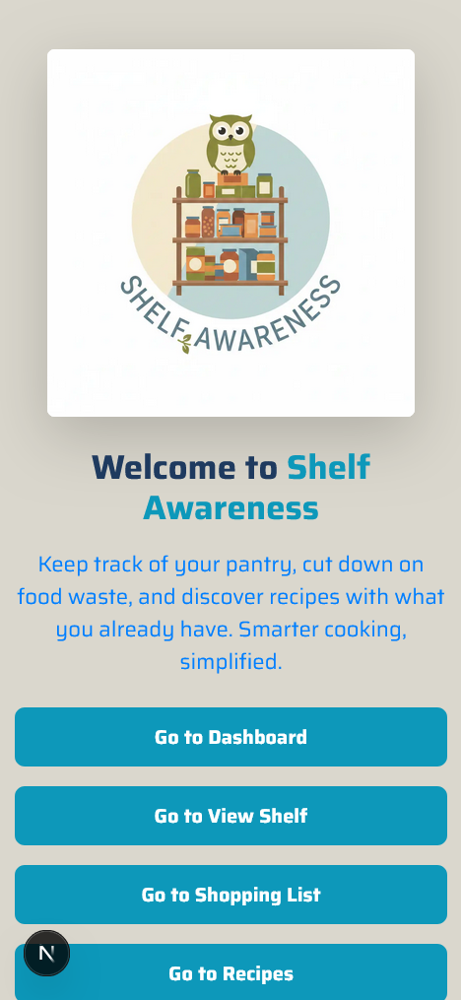
    </td>
  </tr>
</table>

---

## Milestone 3

### Overview
Milestone 3 focused on expanding core functionality while improving overall system stability and user experience. During this phase, we introduced recipe-based grocery list automation, dietary tagging and filtering, recipe cook tracking, completed mobile friendly-ness of already integrated pages, and completed protein integration across the shopping list system.

In addition, significant effort was devoted to database synchronization, schema corrections, and migration cleanup to ensure long-term maintainability and stability as the project scales while beginning to prepare the application for deployment. These updates strengthen both the user-facing experience and the underlying structure of the project, helping ensure the application is more reliable, scalable, and ready for continued development.

#### Dietary Tags and Filtering
We added dietary tags to recipes (such as vegan, vegetarian, keto, gluten-free, and high-protein).

Users can now:
* Added dietary tags (e.g., vegan, vegetarian, keto, gluten-free, high-protein) to the recipe data model
* Support for multiple dietary categories per recipe
* Updated recipe creation and editing forms to allow tag selection
* Visible dietary tags displayed on recipe cards, detail pages, and saved recipes
* Dynamic filtering that allows users to select one or more dietary preferences

This system allows users to quickly find meals aligned with their dietary needs and included the same functionality within the Saved Recipes Page.

  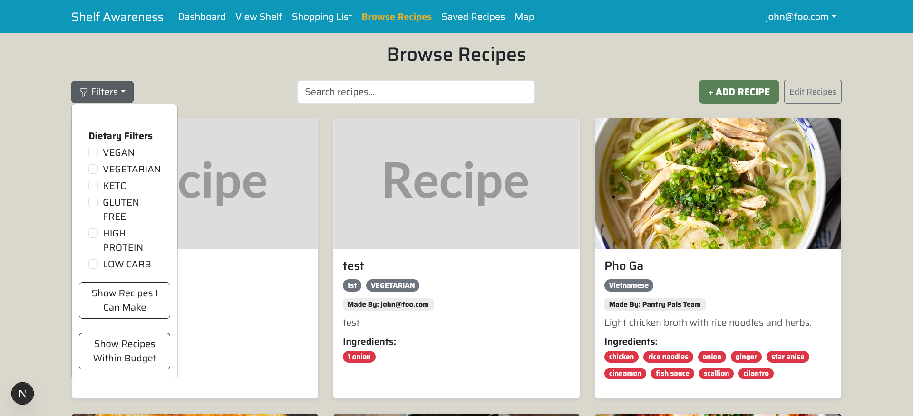

  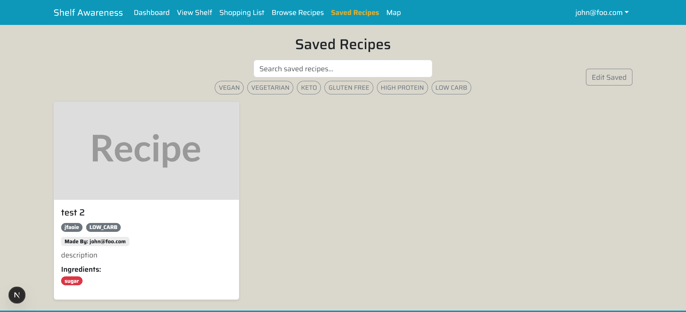

#### Recipes-Cooked Tracking
The app now tracks how often a recipe is cooked.

Each time a recipe is marked as cooked:
* Stores usage data in the database
* Updates counts dynamically
* Supports per-recipe tracking and structured data storage for future personalization features

This helps users see which recipes they use most often and sets up future personalization features.

#### Protein Integration Completed
Protein tracking was fully integrated into the shopping list system.
* Added a protein field to the shopping list edit modal
* Displayed protein values directly on the shopping list page

This keeps nutritional tracking consistent across recipes and grocery planning.

#### Automatic Grocery List from Selected Recipes
The app now generates a grocery list based on selected recipes.

When users choose multiple recipes, the system:
* Calculates the total quantity needed per ingredient
* Merges duplicate items into a single entry
* Generates a consolidated shopping list

  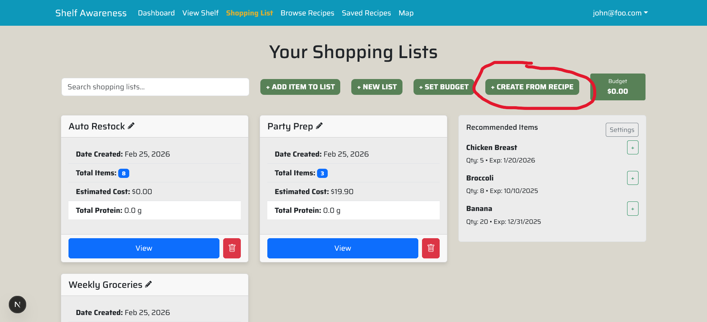

  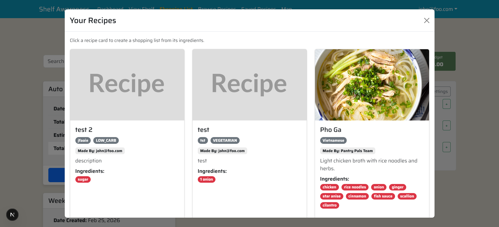

#### Database Fixes and Migration Cleanup
We resolved several database and migration issues that were causing conflicts.

This included:
* Removing duplicate migrations
* Syncing local databases
* Updating the schema to properly support recipe usage tracking
* Fixing a routing issue that affected the shopping list page

This work ensures long-term maintainability and reduces technical debt introduced by prior iterations and branching conflicts.

#### Ingredient Substitution System
The app now supports ingredient substitution suggestions for missing recipe items. This includes a centralized substitution mapping and inline display within recipes. This makes recipes more flexible and helps users cook even when ingredients are missing.

This includes: 
* Supports multiple substitutes per ingredient
* Stored substituion data in Database
* Displays valid substitutes inline for missing ingredients

  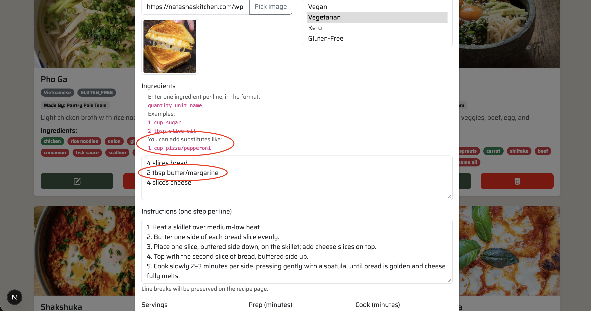

  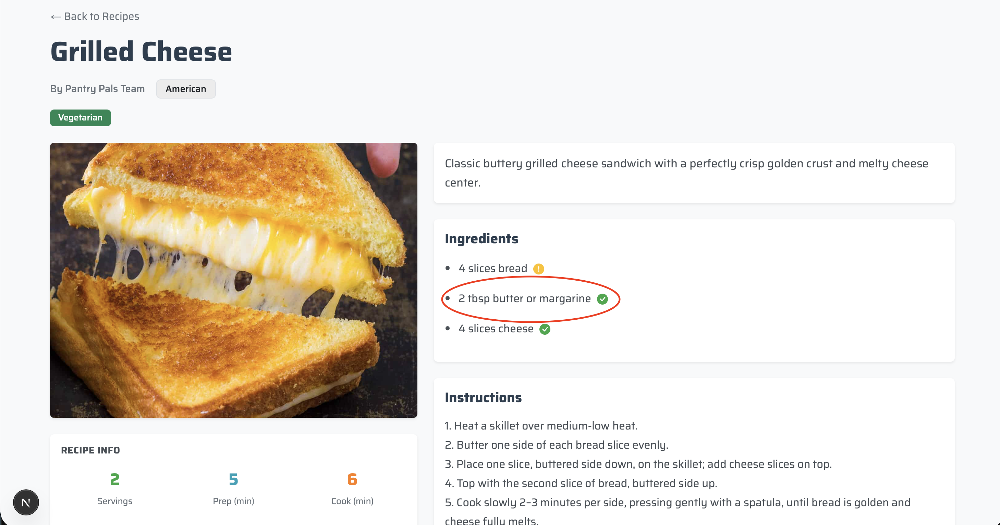

